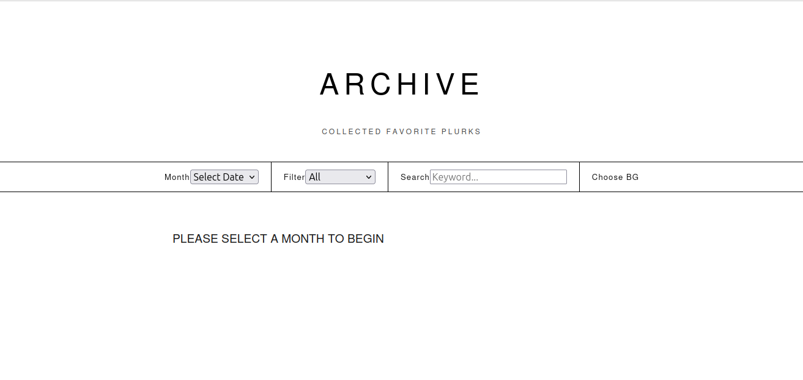

# Plurk Favorite Archive (噗浪喜愛噗文備份工具)

[繁體中文] | ~~[English](unavailable)~~ | ~~[日本語](unavailable)~~

這是一個專為噗浪（Plurk）使用者開發的**備份工具**。它可以將個人帳號中所有的「喜愛噗文」完整抓取，並產生一個可自行設定背景圖的網頁介面，方便隨時離線瀏覽。


---
## 🗄️ 資料儲存機制 (v2.0 重要變更 20260214)

本工具已從純 JS 儲存升級為 **SQLite + JS 雙重機制**：

1.  **SQLite (plurk_favorites.db)**: 作為「原始資料庫 (Source of Truth)」。所有從 Plurk API 抓取的資料會先完整存入資料庫。即使您在 Plurk 上取消了最愛，資料庫內仍會保留備份。
2.  **JavaScript 檔案**: 僅作為前端顯示使用。程式會根據資料庫內容自動產出 `YYYY_MM.js` 檔案。
3.  **局部更新 (Performance)**: 
    - 在「增量備份」模式下，程式僅重新產生「受影響月份」的 JS 檔案，大幅減少磁碟 I/O 並加快大型帳號的同步速度。

### ⚠️ 隱私與備份提醒

- **隱私安全**: `plurk_favorites.db` 包含您的私人最愛紀錄，預設已加入 `.gitignore`。**請勿**將此檔案上傳至公開的 GitHub repository。
- **手動備份**: 若要更換電腦執行備份，請務必手動複製整個 `backup_js/` 資料夾（包含 `.db` 檔案），否則新環境會判定為首次執行並觸發完整備份。
- **資料復原**: 若 JS 檔案毀損，只要 `.db` 檔案還在，執行「模式 3：完整備份」即可重新產生所有 JS 檔案。
---

## ✨ 重點特色

* **🚀 零設定啟動**：提供 Windows 與 macOS 執行檔，無需安裝 Python 環境即可運作。
* **💎 極致視覺體驗**：產出的備份網頁採用現代化 UI 設計，針對電腦版瀏覽器進行最佳化。
* **🔒 安全防護**：個人帳號存取權限（Access Token）僅儲存在您電腦本地端的 `tool.env` 中，不會外流。
* **📂 自動化整理**：系統會自動依月份分類儲存，並支援「增量更新」（每次僅抓取新的噗文）。

---

## 📥 下載與使用說明

### 1. 取得工具

請前往 [Releases](https://github.com/rkwithb/Plurk-Get-Favorites-Tool/releases) 頁面下載對應個人作業系統的執行檔：

* **Windows**: 下載 `Plurk_Archive_Win.exe`
* **macOS**: 下載 `Plurk_Archive_Mac`

### 2. 設定 API 金鑰 (重要)

1. 第一次執行程式時，系統會自動在同目錄下產生一個 `tool.env` 檔案。
2. [如何申請噗浪 API Key](./Tutorial/plurkappkey.md)
3. 使用記事本開啟 `tool.env`，將取得的 **App Key** 與 **App Secret** 填入（請勿與別人共用）。

#### 💡 填寫範例與規範

請嚴格遵守以下格式，**等號 `=` 前後不可有任何空格**：

```env
PLURK_CONSUMER_KEY=你的AppKey(緊接等號，不可有空白)
PLURK_CONSUMER_SECRET=你的AppSecret(緊接等號，不可有空白)
PLURK_ACCESS_TOKEN=
PLURK_ACCESS_TOKEN_SECRET=

```

* **注意**：下方兩項 `ACCESS_TOKEN` 請保持空白，程式執行授權後會自動幫您寫入。

### 3. 開始備份

1. 再次執行程式，依照提示前往網頁進行授權。
2. 將取得的驗證碼（Verifier）貼回程式視窗。
3. 程式會自動取得 Access Token 並存入 `tool.env`（下次執行免授權），隨後開始同步資料至 `backup_js` 資料夾。

### 4. 瀏覽備份內容

備份完成後，直接開啟專案根目錄下的 `index.html` 即可開始瀏覽自己的最愛清單。

---

## ❓ 疑難排解 (Troubleshooting)

### 🍎 macOS 使用者無法開啟程式？

1. 在 `Plurk_Archive_Mac` 檔案上點擊 **滑鼠右鍵**。
2. 選擇選單最上方的 **「開啟」**。
3. 在彈出的系統視窗中，再次點擊 **「開啟」** 即可。

### 📱 如何在手機上瀏覽備份？

建議將產出的檔案（`index.html`、`backup_js` 資料夾等）上傳至以下免費空間：

* [Vercel](https://vercel.com/) (推薦：直接將資料夾拖放至網頁即可完成)
* [Cloudflare Pages](https://pages.cloudflare.com/)
* [GitHub Pages](https://pages.github.com/)

---

## 🛠 深度開發資訊 (For Developers)

1. Clone 本project至自己的電腦。
2. 執行 `pip install -r requirements.txt` 安裝相依套件。
3. 透過推送 Git Tag（例如 `v1.0.0`）觸發 GitHub Actions 流程。

---

## 📜 免責聲明

本工具僅供個人技術研究與資料備份使用，請務必遵守噗浪官方之 API 使用規範。

---

## 授權條款 (License)

本專案採用 CC BY-NC 4.0 授權，詳情請參閱 [LICENSE](LICENSE.md) 檔案。

This project is licensed under the CC BY-NC 4.0. Please see the [LICENSE](LICENSE.md) file for more information.
