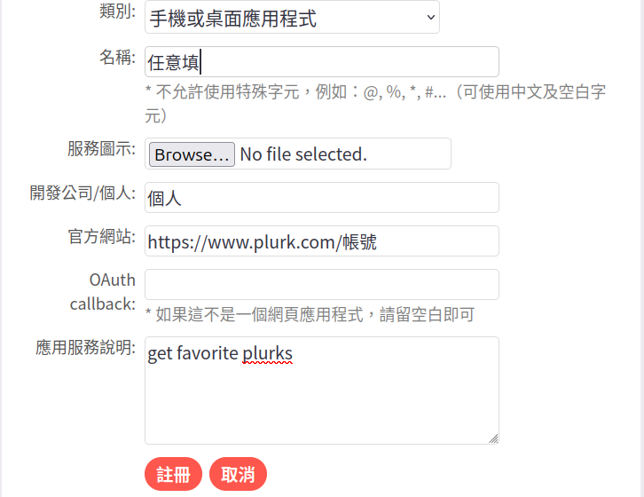

# 噗浪 Plurk 應用程式 申請教學

本教學將引導你取得開發Plurk應用程式所需的 **Consumer Key** 與 **Consumer Secret**。

## 📌 準備工作

1. 擁有一個噗浪帳號。
2. 確認已登入噗浪。

---

## 🚀 申請步驟

### 1. 進入開發者中心

請前往噗浪的應用程式管理頁面：
👉 [https://www.plurk.com/PlurkApp/](https://www.plurk.com/PlurkApp/)

### 2. 註冊新應用程式

點擊頁面上的 **「註冊新的應用服務」** 按鈕，並填寫以下資訊：

| 欄位名稱 | 建議填寫內容 |
| --- | --- |
| **App Title** | 你的應用程式名稱（例如：我的Plurk程式） |
| **App Summary** | 簡單描述這個程式的功能 |
| **Website** | 你的 GitHub 專案網址或個人網站（必填） |
| **Category** | 選擇符合項目比如「手機或桌面應用程式」 |
| **OAuth callback** | **保持空白**（除非你有特定伺服器需求） |

> [!IMPORTANT]
> 填寫完畢後勾選同意條款，按下「註冊」即可。

### 3. 取得 Consumer Key & Secret

註冊成功後，你會在列表中看到你的應用程式。點擊 **「編輯」** 進入詳細頁面：

* **App Key**：這就是你的 `Consumer Key`。
* **App Secret**：這就是你的 `Consumer Secret`。

---

## ⚠️ 安全提醒

* **絕對不要** 將你的 `Secret` 上傳到公開的 GitHub Repo。
* 建議使用 `.env` 檔案管理存放這些敏感資訊
* 程式開發提醒: git開發時將其加入 `.gitignore`。

---
